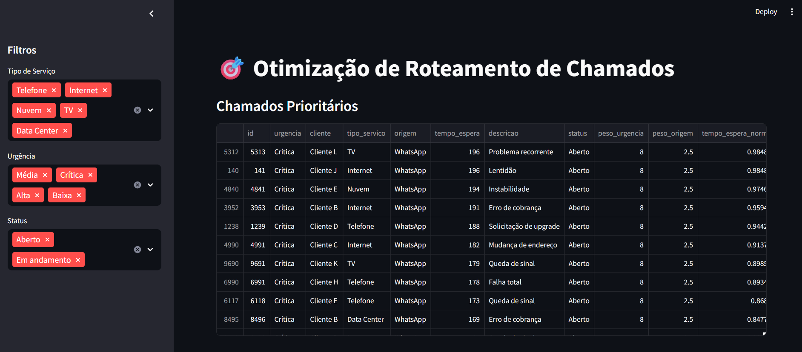
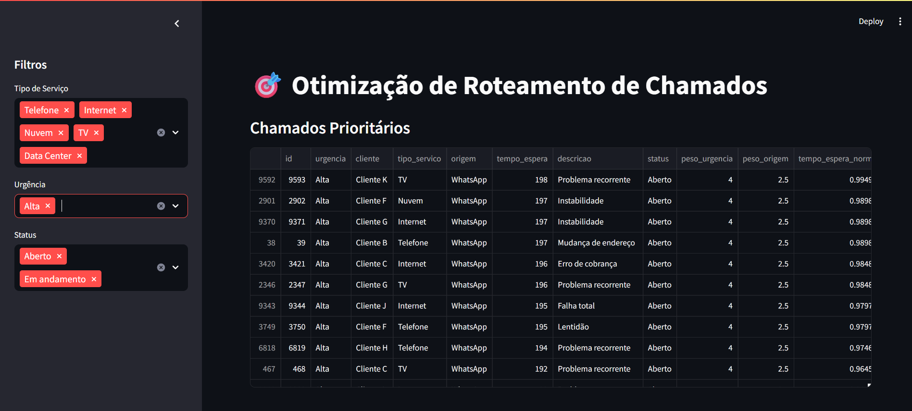
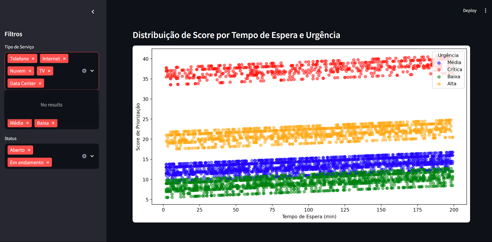

# 🎯 Otimização de Roteamento de Chamados Internos com Algoritmo de Priorização

Este projeto simula e implementa um sistema de triagem inteligente para tickets de atendimento interno, usando análise de dados, criação de features de priorização, clustering não supervisionado (KMeans) e dashboard interativo. O objetivo é auxiliar empresas de tecnologia e telecom a identificar rapidamente quais chamados devem ser atendidos primeiro, melhorando a eficiência operacional e a satisfação dos clientes.

## 📌 **Demonstração do projeto**





---

## 📌 **Resumo do Projeto**

- **Geração de dados realistas** de chamados (tickets), com atributos como urgência, cliente, tipo de serviço, origem, descrição, tempo de espera e status.
- **Engenharia de features** para criar um score de priorização ajustável, considerando urgência, origem, tempo de espera, status e outros fatores de negócio.
- **Clustering (KMeans)** para agrupar chamados por perfis e identificar padrões de atendimento.
- **Sistema de recomendação** automática dos chamados mais críticos para cada equipe.
- **Dashboard interativo** (Streamlit) para visualização, filtros, análise dos principais tickets e gráficos explicativos.
- **Notebooks didáticos** mostrando todo o passo a passo, análise exploratória e justificativas.
- **Canvas de Design Thinking** sugerido para demonstrar visão de inovação e experiência do usuário.

---

## 📂 **Sobre a Base de Dados (`data/tickets.csv`)**

A base de dados `tickets.csv` simula um cenário realista de uma central de atendimento interno de uma empresa de tecnologia ou telecom. Cada linha representa um chamado (ticket) aberto por um cliente, com informações relevantes para triagem e priorização.

### **Dicionário de Dados**

| Coluna               | Tipo     | Descrição                                                                                                                                      |
|----------------------|----------|-----------------------------------------------------------------------------------------------------------------------------------------------|
| `id`                 | int      | Identificador único do chamado                                                                                                                 |
| `urgencia`           | str      | Nível de urgência do chamado. Valores possíveis: `Baixa`, `Média`, `Alta`, `Crítica`                                                          |
| `cliente`            | str      | Nome do cliente (simulado como Cliente A, Cliente B, etc.)                                                                                    |
| `tipo_servico`       | str      | Tipo do serviço relacionado ao chamado. Ex: `Internet`, `Telefone`, `TV`, `Nuvem`, `Data Center`                                              |
| `origem`             | str      | Canal pelo qual o chamado foi aberto. Ex: `Autoatendimento`, `Telefone`, `WhatsApp`, `Email`, `App`                                           |
| `tempo_espera`       | int      | Tempo (em minutos) desde a abertura do chamado até o momento atual                                                                             |
| `descricao`          | str      | Descrição resumida do problema reportado. Ex: `Instabilidade`, `Lentidão`, `Falha total`, `Solicitação de upgrade`, etc.                      |
| `status`             | str      | Status atual do chamado. Valores possíveis: `Aberto`, `Em andamento`, `Resolvido`                                                             |
| `peso_urgencia`      | int      | Valor numérico que representa o peso/prioridade da urgência (definido pela regra de negócio no projeto)                                        |
| `peso_origem`        | float    | Valor numérico do peso do canal de origem do chamado                                                                                           |
| `tempo_espera_norm`  | float    | Tempo de espera normalizado entre 0 e 1 (para facilitar algoritmos de clustering/priorização)                                                 |
| `score_priorizacao`  | float    | Score calculado de priorização, levando em conta urgência, origem, tempo de espera e status, usado para recomendar a ordem de atendimento      |

#### **Notas Importantes:**
- As colunas `peso_urgencia`, `peso_origem`, `tempo_espera_norm` e `score_priorizacao` são **features criadas na etapa de engenharia de atributos** e não fazem parte de sistemas de Help Desk reais, mas sim de uma lógica de priorização personalizada para o projeto.
- O campo `descricao` foi simulado para representar casos reais que chegam à central.
- O dataset pode ser expandido ou adaptado para contextos reais, incluindo mais variáveis (como região, SLA, responsável, etc).

**Exemplo de uma linha da base:**

| id | urgencia | cliente   | tipo_servico | origem         | tempo_espera | descricao       | status      | peso_urgencia | peso_origem | tempo_espera_norm | score_priorizacao |
|----|----------|-----------|--------------|----------------|--------------|-----------------|-------------|---------------|-------------|-------------------|------------------|
| 12 | Alta     | Cliente G | Internet     | WhatsApp       | 102          | Lentidão        | Aberto      | 4             | 2.5         | 0.60              | 24.55            |

---

## ⚙️ **Como Rodar o Projeto**

### **1. Clonar o repositório**

```bash
git clone https://github.com/seu-usuario/ticket-routing.git
cd ticket-routing
```

### **2. Criar o ambiente virtual e instalar dependências**
```bash
python -m venv venv
# Ative o ambiente:
# Windows:
venv\Scripts\activate
# Linux/macOS:
source venv/bin/activate

pip install -r requirements.txt
```

### **3. Gerar os dados sintéticos**
```bash
python notebooks/00_gera_tickets.py
```

### **4. Executar os notebooks de análise e clustering**
Abra os arquivos em um Jupyter Notebook ou Google Colab:

- Análise exploratória e features:
notebooks/01_exploracao_e_features.ipynb

- Clustering e recomendação:
notebooks/02_clustering_e_recomendacao.ipynb

### **5. Rodar o dashboard interativo**
```bash
streamlit run app/dashboard.py
```

## 🗂️ **Estrutura do projeto**
```bash
ticket-routing/
├── data/
│   └── tickets.csv              # Dados simulados
├── notebooks/
│   ├── 00_gera_tickets.py       # Script para gerar os dados
│   ├── 01_exploracao_e_features.ipynb
│   └── 02_clustering_e_recomendacao.ipynb
├── app/
│   └── dashboard.py             # Dashboard interativo
├── requirements.txt             # Dependências do projeto
├── README.md
└── LICENSE
```

## 🧠 **Principais Etapas do Projeto**

### 1. Geração e Exploração dos Dados

- Simulação de 500 chamados com atributos variados.
- Visualização da distribuição de urgência, tempo de espera, tipos de serviço, etc.
- Gráficos para analisar pontos críticos, identificar outliers e padrões sazonais.

### 2. Engenharia de Features

- Criação de colunas de peso para urgência e origem.
- Normalização do tempo de espera.
- Cálculo do score de priorização, levando em conta múltiplos critérios de negócio.

### 3. Clustering (KMeans)

- Agrupamento automático dos chamados em 4 perfis para descobrir padrões.
- Análise de médias por cluster, identificando grupos de tickets com características semelhantes (ex: urgência alta, longa espera).

### 4. Recomendação Automática

- Seleção dos tickets mais prioritários para cada equipe, com base no score.
- Suporte à tomada de decisão rápida para atendimento.

### 5. Dashboard Interativo

- Filtros por tipo de serviço, urgência e status.
- Tabela dinâmica dos chamados priorizados.
- Gráfico de dispersão para explicar visualmente o perfil dos tickets.
- Fácil de usar por analistas, supervisores ou gerentes.

## 📊 **Exemplo de Gráficos**

- Histograma dos scores de priorização
- Gráfico de dispersão dos clusters
- Tabela dos principais chamados para ação imediata

## 💡 **Canvas de Design Thinking**

- **Persona**: Analista de suporte/técnico de atendimento.
- **Problema**: Muitas solicitações, difícil saber qual atender primeiro. Clientes insatisfeitos por falta de priorização adequada.
- **Solução**: Algoritmo inteligente de roteamento, com score de priorização e clusters de perfis de chamados.
- **Ganho**: Agilidade, redução de tempo de espera, aumento da satisfação do cliente, melhor distribuição de carga entre equipes.

## 🛠️ **Tecnologias Utilizadas**

- Python 3.8+
- pandas, numpy, scikit-learn, matplotlib, seaborn
- Streamlit (dashboard)
- Jupyter Notebook/Google Colab

## 📈 **Possíveis Expansões**

- Adição de modelos supervisionados para previsão de tempo de resolução
- Integração com APIs reais de Help Desk (ex: Freshdesk, Zendesk)
- Alerta automático para chamados críticos
-Geração de relatórios periódicos para gestão
